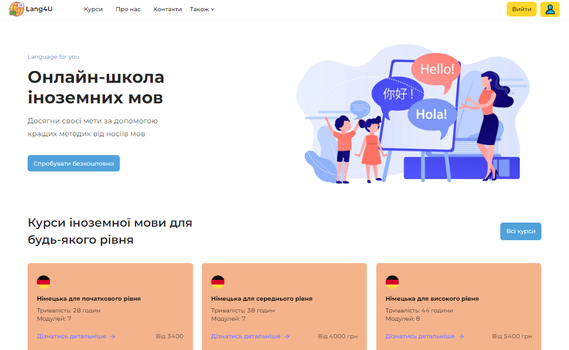
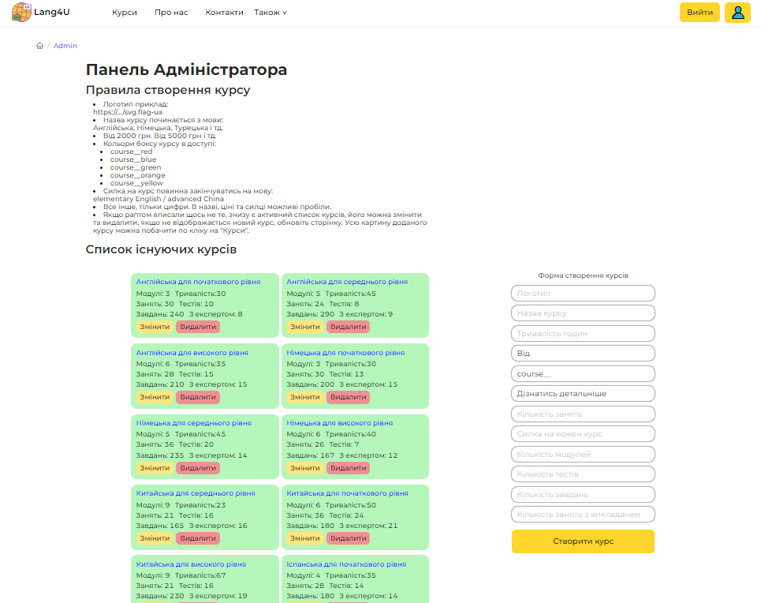
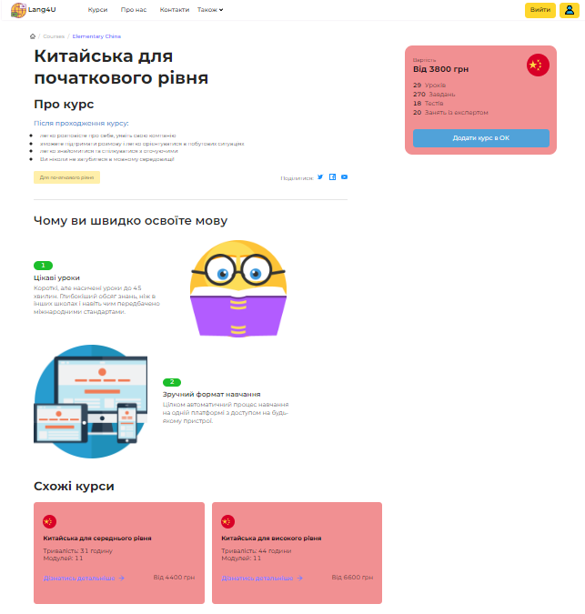
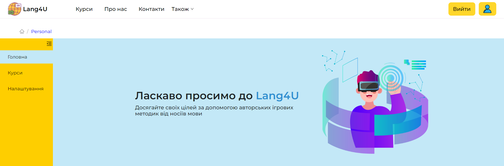
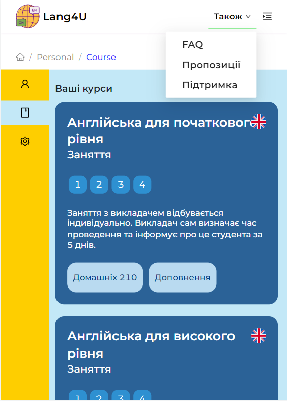
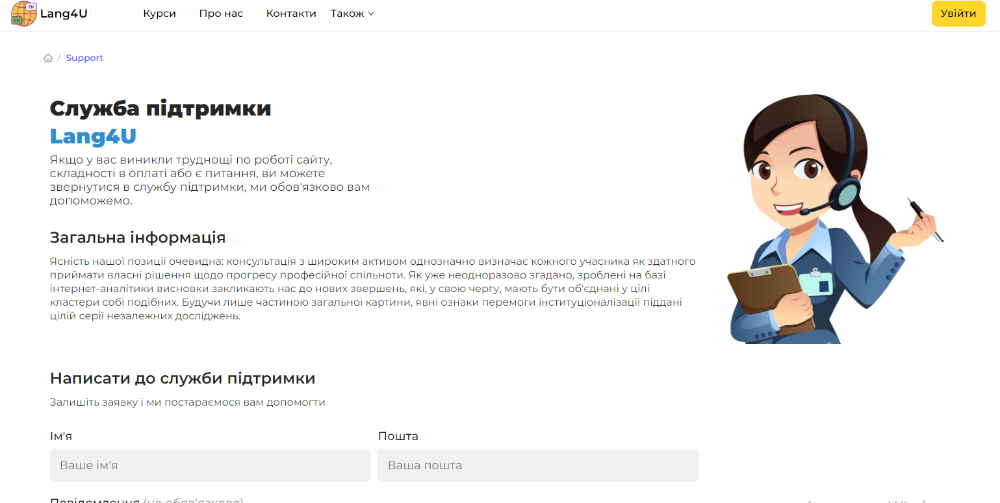
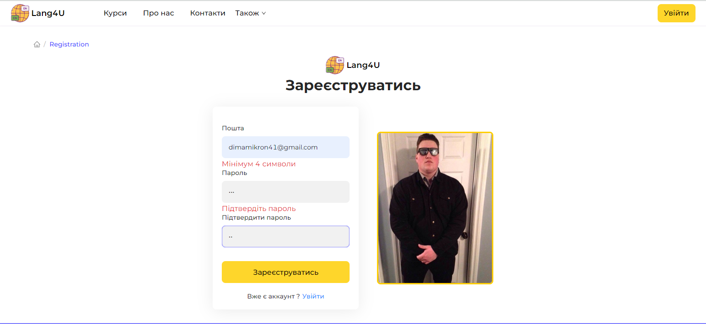
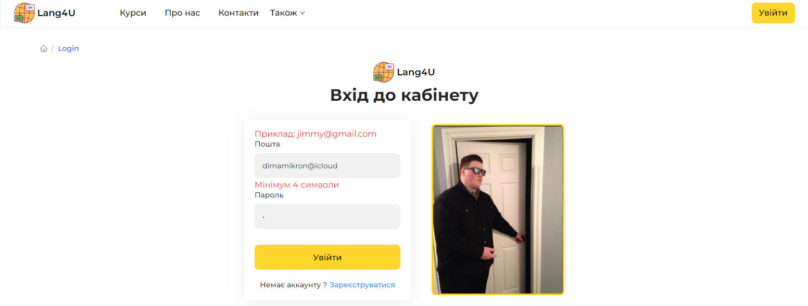

BackEnd: https://github.com/DmitryMass/Lang4U_Server_MongoDB

Server: работает на Render.com
С данной платформой работают все запросы, весь функционал, кроме просмотра добавленных курсов себе в личный кабинет (Promise All); - разобраться
Авторизация все формы привязка курса все работает.

В данном сайте отсутсвует оплата курса. При клике авторизованого пользователя вы можете добавить курс в личный кабинет. После он появится вместе с Домашними заданиями и Дополнительной информацией. Ссылки на урок дз\доп, исключительно импровизируемые, тобишь путсышки, для того чтобы видеть как в конечном итоге должно все быть. (если бы курсы существовали \ так же при существовании курсов были бы добавлены в админ панель спец поля для добавления ссылок на каждый курс).
Цвета, картинки, лого, название, дизайн и логика, все построено самостоятельно из головы. Часть текста, идею расположения некоторых элементов сайта присматривал в макете фигмы.

Стек технолгий (Изначально был PERN);
Закрывают доступ на хероку для постгреса, по этому был переделан полностью на (MERN + TS);

Не полный бек который был на PostgreSQL:https://github.com/DmitryMass/Lang4u_Server

MongoDB / Express/ React / NodeJs

FrontEnd:
React (hooks);
RTK(redux-toolkit), RTK-Query (Хранилище, Апи, слайсы, очистка кеша);
Promise-All;
Ant Ant-icons;
Formik-Yup (формы-валидация);
Scss (module.scss);
TypeScript;
Swiper (для слайдеров);

Работа токенов в заголовках

//
BackEnd:
NodeJs(Express) + TypeScript;
Express(валидация, роутинг, парсинг и тд)
Nodemon (auto-refresh);
NodeMailer (для отправки писем);
JsonWebtoken / bcrypt (шифрование паролей, добавление токена)
MongoDB / mongoose; (хранение данных)

<!--  -->

Preview

<!--  -->

29/10/2022 проект в разработке

временный деплой на netlify изменить все на хероку или ток бд
задача не забыть изменить

<!--  -->

- формы регистрации логина // Complete
- Tabs/Breadcrumb, проверить локацию, отфильтровать без квери параметров, убрать %20 при рефреше страницы // Complete +

* подключить бек по авторизации // complete on localhost
* отдельный пункт личного кабинета // complete
* разобраться с данными которые хранятся в обьектах, пробовать перенести в бд или свободный апи (обдумать админку) // complete
* после сохранения данных, сделать запросы Лоадеры Ошибки. // complete

Добавить Мультиязычность, i18, поиграть с ней же с Путями

<!--  -->

10.11 // Добавить типизации тайпскрипта, в местах где временно стоит any или совсем ничего. Особенно в апи

- Nav , для повторного использования, списков по названию для навигации продумать исправить

//upload logo (без статики експресса, чистый линк) - для админки
все правила добавления новых курсов описаны в админ панеле.

Пример:
https://www.svgrepo.com/show/110211/united-kingdom.svg
https://www.svgrepo.com/show/131993/germany.svg
https://www.svgrepo.com/show/401755/flag-for-spain.svg
https://www.svgrepo.com/show/132022/china.svg
